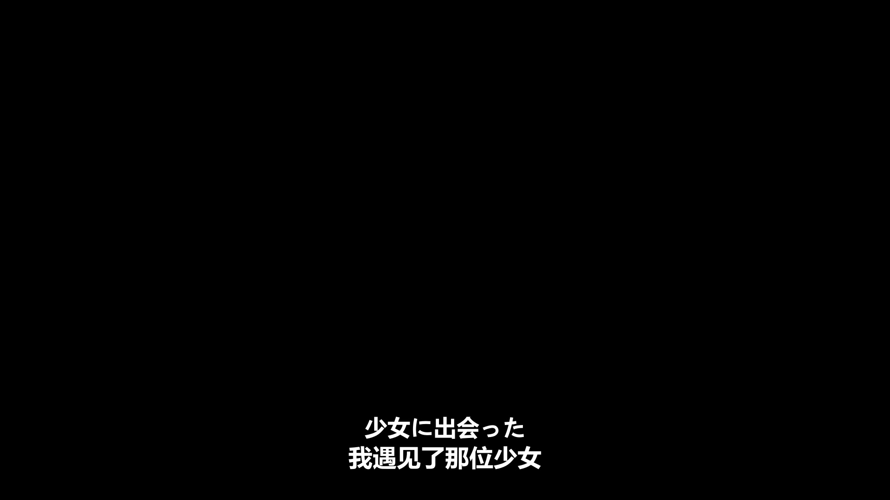

# 中日双语-演唱会字幕-带歌曲翻译-codexskill

为演唱会、LIVE、现场音乐视频制作并烧录双语字幕（原文 + 译文）的 Codex skill。固定流水线：查询歌单 → 抽音频 → ASR → 获取歌词并对轴 → 校对翻译 → 分段审核 → 按原范围整合。

## 版权与使用边界

本仓库只提供字幕制作流程和脚本。用户必须拥有源视频、歌词和译文的合法使用权，并遵守当地著作权法律。未获授权的内容不要抓取、烧录或公开分发。详见 [DISCLAIMER.md](DISCLAIMER.md)。

## 成片效果

默认输出为底部居中的双语双行字幕：原文在上，译文在下。

- 字幕位置：底部居中，`MarginV=40`（ASS 的 720p 坐标系，输出到 1080p 视频时等比放大为约 60px）
- 原文字体：`Meiryo`，字号 `42`
- 译文字体：`Microsoft YaHei`，字号 `44`
- 文字样式：白色字体、黑色描边、轻阴影；原文字号比译文小 2
- 每条 cue 只保留两行，不自动折行、不叠加



## 安装

```powershell
git clone https://github.com/UPxianyu/Chinese-Japanese-bilingual-subtitles-skills.git
New-Item -ItemType Directory -Force "$env:USERPROFILE\.codex\skills\concert-bilingual-subtitles" | Out-Null
Copy-Item -Recurse -Force .\Chinese-Japanese-bilingual-subtitles-skills\SKILL.md, .\Chinese-Japanese-bilingual-subtitles-skills\agents, .\Chinese-Japanese-bilingual-subtitles-skills\references, .\Chinese-Japanese-bilingual-subtitles-skills\scripts "$env:USERPROFILE\.codex\skills\concert-bilingual-subtitles"
```

安装后，在 Codex 中要求“给演唱会视频加双语字幕 / 先分段审核再合并”即可自动触发。

## 使用方式

在 Codex 中直接描述任务即可，建议提供视频路径、原语言、译语言和时间范围：

> 帮我给 `E:\videos\live.mp4` 做中日双语字幕，范围 `01:02:00` 到 `02:57:00`。先按歌曲分段输出给我审核，确认后再整合成完整成片。

也可以指定“只处理某一段”“字幕不烧录进画面，只导出 ASS/SRT”“译文使用繁体中文”等要求。

## 输出文件

- 分段审核：`output/切段/` 下的分段 MP4、ASS、SRT 和清单
- 最终成片：默认 `out.mp4`，同时生成同名 ASS/SRT
- 校对说明：记录歌词纠错、翻译取舍和 ASR 兜底来源

## 依赖

- ffmpeg / ffprobe，需带 `libass` 和 `libx264`
- Python 3.10+，ASR 需在虚拟环境中安装 `faster-whisper`
- 歌词与翻译由用户主动提供，不依赖第三方歌词抓取接口

## 歌词来源

歌词与翻译优先来自用户自行查找的字幕网站或官方歌词页。用户可以把原文歌词和译文直接粘贴给 Codex，也可以提供 LRC、TXT 或 JSON 文件。

如果用户暂时没有提供歌词，则使用 ASR 转写后校对、翻译，并在校对说明中标注 `ASR`。

## 主要脚本

- `scripts/asr_transcribe.py`：faster-whisper 转写并输出词级时间戳
- `scripts/make_bilingual_subs.py`：从 cues 生成双语 ASS/SRT
- `scripts/build_segments.py`：按歌曲/段落生成审核片段
- `scripts/merge_segments.py`：按原范围一次性整合并校验时长

详细流程见 `SKILL.md` 和 `references/lyrics_sources.md`。

## 测试

```bash
python -m unittest discover -s tests -v
```

仓库配置了 GitHub Actions，会在 push / pull request 时运行最小冒烟测试。

## 许可证与安全

- 代码采用 [MIT License](LICENSE)
- 使用边界见 [DISCLAIMER.md](DISCLAIMER.md)
- 安全报告方式见 [SECURITY.md](SECURITY.md)
