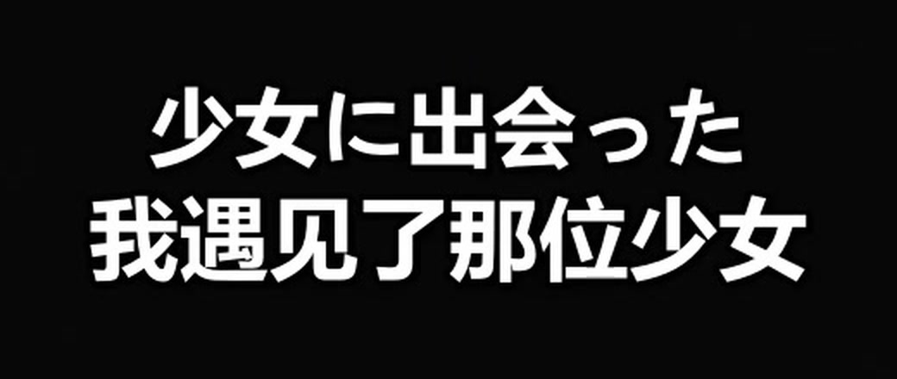

# 中日双语-演唱会字幕-带歌曲翻译-codexskill

为演唱会、LIVE、现场音乐视频制作并烧录双语字幕（原文 + 译文）的 Codex skill。固定流水线：查询歌单 → 抽音频 → ASR → 扒官方歌词并对轴 → 校对翻译 → 分段审核 → 按原范围整合。

## 成片效果

默认输出为底部居中的双语双行字幕：原文在上，译文在下。

- 字幕位置：底部居中，`MarginV=40`（ASS 的 720p 坐标系，输出到 1080p 视频时等比放大为约 60px）
- 原文字体：`Meiryo`，字号 `42`
- 译文字体：`Microsoft YaHei`，字号 `44`
- 文字样式：白色字体、黑色描边、轻阴影；原文字号比译文小 2
- 每条 cue 只保留两行，不自动折行、不叠加



> 样例截取自 `成片_58.mp4`，已裁剪为仅字幕区域，避免展示可能涉及版权的画面内容。

## 安装

```powershell
git clone https://github.com/UPxianyu/Chinese-Japanese-bilingual-subtitles-skills.git
Copy-Item -Recurse .\Chinese-Japanese-bilingual-subtitles-skills "$env:USERPROFILE\.codex\skills\concert-bilingual-subtitles"
```

安装后，在 Codex 中要求“给演唱会视频加双语字幕 / 先分段审核再合并”即可自动触发。

## 依赖

- ffmpeg / ffprobe，需带 `libass` 和 `libx264`
- Python 3.10+，ASR 需在虚拟环境中安装 `faster-whisper`
- mojigeci 歌词来源通过内置 `scripts/moji_fetch.py` 调用，无需额外依赖

## 主要脚本

- `scripts/asr_transcribe.py`：faster-whisper 转写并输出词级时间戳
- `scripts/moji_fetch.py`：mojigeci 搜索与歌词抓取
- `scripts/make_bilingual_subs.py`：从 cues 生成双语 ASS/SRT
- `scripts/build_segments.py`：按歌曲/段落生成审核片段
- `scripts/merge_segments.py`：按原范围一次性整合并校验时长

详细流程见 `SKILL.md` 和 `references/mojigeci.md`。
